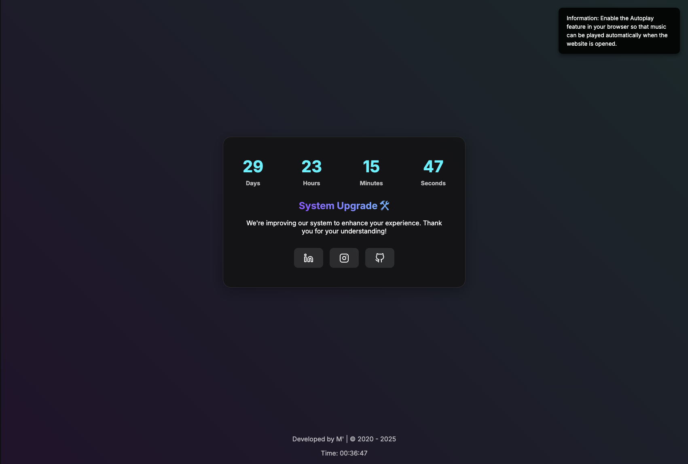

# Zenith Maintenance



## 📌 Deskripsi Proyek
Zenith Maintenance adalah halaman pemeliharaan interaktif yang dirancang untuk memberi tahu pengunjung bahwa situs sedang dalam perbaikan dan akan segera kembali online. Dengan fitur animasi menarik dan elemen interaktif, halaman ini memberikan pengalaman yang lebih dinamis dibandingkan dengan halaman pemeliharaan statis biasa.

## ✨ Fitur Utama
- **⏳ Hitungan Mundur** – Menampilkan waktu real-time hingga situs kembali aktif.
- **✨ Efek Partikel** – Animasi partikel yang memberikan tampilan modern.
- **🎵 Musik Latar** – Musik otomatis yang dapat diaktifkan atau dimatikan oleh pengguna.
- **🔠 Efek Teks Scramble** – Efek animasi teks untuk meningkatkan estetika halaman.
- **🌎 Informasi Pengunjung** – Mengambil dan menampilkan informasi pengunjung berdasarkan IP mereka.
- **🔗 Tautan Sosial Media** – Navigasi langsung ke berbagai platform sosial media.
- **📍 Lokasi Akurat Pengunjung** – Menampilkan lokasi pengunjung dengan akurasi tinggi menggunakan **Geolocation API**.
- **📁 Backup Otomatis Log** – File log akan di-backup secara otomatis jika melebihi ukuran maksimum.
- **🔒 Keamanan yang Ditingkatkan** – Konfigurasi `.htaccess` untuk mencegah akses ke file sensitif dan memblokir bot berbahaya.

## 🛠️ Teknologi yang Digunakan
- **HTML5** – Struktur dasar halaman.
- **CSS3** – Styling modern dengan animasi dan efek visual.
- **JavaScript (Vanilla)** – Menangani efek interaktif dan API eksternal.
- **PHP** – Backend untuk mencatat log aktivitas pengunjung.
- **Apache `.htaccess`** – Konfigurasi untuk optimasi dan keamanan server.

## 🚀 Instalasi & Penggunaan
1. **Clone repositori ini** ke dalam direktori lokal Anda:
   ```sh
   git clone https://github.com/Creative-Trees/Zenith-Maintenance.git
   ```
2. **Masuk ke direktori proyek:**
   ```sh
   cd Zenith-Maintenance
   ```
3. **Konfigurasi server lokal:**
   - Pastikan server Apache Anda mendukung file `.htaccess`.
   - Pastikan PHP diaktifkan untuk mencatat log pengunjung.
4. **Buka file `index.html`** di browser favorit Anda atau gunakan ekstensi Live Server pada VS Code untuk melihat hasilnya secara langsung.

## 📂 Struktur Proyek
```
Zenith-Maintenance/
├── .htaccess                 # Konfigurasi server Apache
├── assets/
│   ├── css/
│   │   └── style.css         # File styling utama
│   ├── js/
│   │   ├── app.js            # Efek partikel & teks scramble
│   │   ├── music.js          # Kontrol musik latar
│   │   ├── visitor.js        # Menampilkan informasi pengunjung
│   ├── music/                # Folder untuk file musik latar
│   ├── img/                  # Folder untuk gambar
├── save-log.php              # Backend untuk mencatat log pengunjung
├── index.html                # Halaman utama
├── LICENSE                   # Lisensi proyek
├── README.md                 # Dokumentasi proyek
```

## 🆕 Pembaruan Versi Terbaru
Berikut adalah fitur dan pembaruan yang telah ditambahkan pada versi terbaru:
- **📍 Lokasi Akurat Pengunjung:**
  - Menggunakan **Geolocation API** dengan `enableHighAccuracy: true` untuk mendapatkan lokasi pengunjung dengan akurasi hingga 1 meter.
  - Fallback ke geolokasi berbasis IP jika pengguna tidak mengizinkan akses lokasi.
- **📁 Backup Otomatis Log:**
  - File log akan di-backup secara otomatis jika melebihi ukuran maksimum 5 MB.
  - Format nama backup: `IP-backup-log-tanggal-bulan-tahun.txt`.
- **🔒 Keamanan yang Ditingkatkan:**
  - Konfigurasi `.htaccess` untuk mencegah akses ke file sensitif seperti `.env`, `.htaccess`, dan file log.
  - Memblokir bot berbahaya seperti `MJ12bot`, `AhrefsBot`, dan lainnya.
- **🌐 Informasi Pengunjung yang Lebih Lengkap:**
  - Menampilkan alamat IP, lokasi (kota, provinsi, negara), koordinat, dan user-agent pengunjung.
- **🛠️ Perbaikan Bug:**
  - Memperbaiki masalah pada fallback lokasi berbasis IP.
  - Menambahkan validasi untuk memastikan data log aman dan bebas dari serangan injeksi.

## 📜 Lisensi
Proyek ini dilisensikan di bawah **[MIT License](LICENSE)**, sehingga dapat digunakan dan dimodifikasi dengan bebas.

## 🤝 Kontribusi
Kami selalu terbuka untuk kontribusi dari komunitas! Jika Anda ingin menambahkan fitur atau memperbaiki bug:
1. Fork repositori ini.
2. Buat branch baru: `git checkout -b fitur-baru`.
3. Commit perubahan Anda: `git commit -m "Menambahkan fitur baru"`.
4. Push ke branch Anda: `git push origin fitur-baru`.
5. Ajukan **Pull Request**!

## 📞 Kontak & Sosial Media
Jika ada pertanyaan atau ingin berdiskusi lebih lanjut, silakan hubungi saya melalui:
- **GitHub** – [halfirzzha](https://github.com/halfirzzha)
- **LinkedIn** – [halfirzzha](https://linkedin.com/in/halfirzzha)
- **Instagram** – [halfirzzha](https://instagram.com/halfirzzha)

Terima kasih telah mendukung proyek ini! 🚀
```